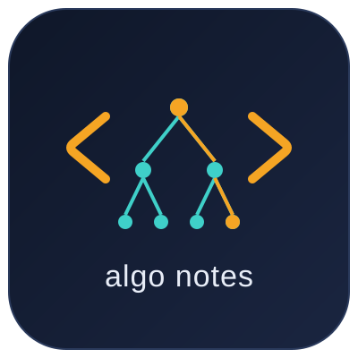

<p align="center"></p>

# leet-code-algo

Algorithm problems solved in TypeScript, for interview practice. Each problem has an explanation of the approach, a solution you can paste into LeetCode, and tests that run it like LeetCode's "Run" button. Each explanation links to the [Hello Interview](https://www.hellointerview.com/learn/code) lesson on its pattern. New problems, or whole LeetCode problem lists, are added by a Claude Code agent.

```
problems/
  167. Two Sum II - Input Array Is Sorted/
    README.md          explanation, walkthrough, complexity, theory link
    solution.ts        the solution
    solution.test.ts   runs the examples and edge cases
assets/logo.svg        repo logo
scripts/run.ts         test runner behind `npm test`
.claude/agents/        the add-algo agent
```

## Running

First time: `npm install`

- `npm test` — run every problem
- `npm test 167` — run one problem by number (or several: `npm test 1 167`)
- In VS Code, with any file of a problem open:
  - **F5** — run that problem's tests (breakpoints work)
  - **Cmd+Shift+P → "Tasks: Run Test Task"** — run it without the debugger

## Adding problems

Ask Claude Code to use the `add-algo` agent (defined in [.claude/agents/add-algo.md](.claude/agents/add-algo.md)) and give it a link:

- **One or more problems** — e.g. "use add-algo for https://leetcode.com/problems/two-sum/". Works with LeetCode, leetcode.cn, NeetCode, Codewars, HackerRank, GeeksforGeeks and other judges.
- **A LeetCode problem list** — e.g. "use add-algo for https://leetcode.com/problem-list/0ev1o401/". Adds only the problems the repo doesn't have yet and skips premium ones.

Each problem gets a `problems/{number}. {Title}` folder with:

- `README.md` — the statement, approach, a walkthrough of Example 1, complexity, and a link to the matching [Hello Interview](https://www.hellointerview.com/learn/code) lesson
- `solution.ts` — the solution, ready to paste into LeetCode
- `solution.test.ts` — runs the examples and edge cases like LeetCode's "Run" button

## Problems by pattern

| Pattern | Problems to train |
|---|---|
| Hash Map | [1. Two Sum](problems/1.%20Two%20Sum/)<br>[49. Group Anagrams](problems/49.%20Group%20Anagrams/)<br>[242. Valid Anagram](problems/242.%20Valid%20Anagram/)<br>[350. Intersection of Two Arrays II](problems/350.%20Intersection%20of%20Two%20Arrays%20II/) |
| [Two Pointers](https://www.hellointerview.com/learn/code/two-pointers/overview) | [11. Container With Most Water](problems/11.%20Container%20With%20Most%20Water/)<br>[75. Sort Colors](problems/75.%20Sort%20Colors/)<br>[151. Reverse Words in a String](problems/151.%20Reverse%20Words%20in%20a%20String/)<br>[167. Two Sum II - Input Array Is Sorted](problems/167.%20Two%20Sum%20II%20-%20Input%20Array%20Is%20Sorted/)<br>[283. Move Zeroes](problems/283.%20Move%20Zeroes/) |
| [Sliding Window (fixed size)](https://www.hellointerview.com/learn/code/sliding-window/fixed-length) | [438. Find All Anagrams in a String](problems/438.%20Find%20All%20Anagrams%20in%20a%20String/)<br>[643. Maximum Average Subarray I](problems/643.%20Maximum%20Average%20Subarray%20I/) |
| [Sliding Window (variable size)](https://www.hellointerview.com/learn/code/sliding-window/variable-length) | [3. Longest Substring Without Repeating Characters](problems/3.%20Longest%20Substring%20Without%20Repeating%20Characters/)<br>[209. Minimum Size Subarray Sum](problems/209.%20Minimum%20Size%20Subarray%20Sum/) |
| [Prefix Sum](https://www.hellointerview.com/learn/code/prefix-sum/overview) | [238. Product of Array Except Self](problems/238.%20Product%20of%20Array%20Except%20Self/)<br>[560. Subarray Sum Equals K](problems/560.%20Subarray%20Sum%20Equals%20K/)<br>[1292. Maximum Side Length of a Square with Sum Less than or Equal to Threshold](problems/1292.%20Maximum%20Side%20Length%20of%20a%20Square%20with%20Sum%20Less%20than%20or%20Equal%20to%20Threshold/) |
| [Binary Search](https://www.hellointerview.com/learn/code/binary-search/overview) | [33. Search in Rotated Sorted Array](problems/33.%20Search%20in%20Rotated%20Sorted%20Array/)<br>[35. Search Insert Position](problems/35.%20Search%20Insert%20Position/)<br>[69. Sqrt(x)](problems/69.%20Sqrt%28x%29/)<br>[153. Find Minimum in Rotated Sorted Array](problems/153.%20Find%20Minimum%20in%20Rotated%20Sorted%20Array/)<br>[704. Binary Search](problems/704.%20Binary%20Search/)<br>[729. My Calendar I](problems/729.%20My%20Calendar%20I/)<br>[852. Peak Index in a Mountain Array](problems/852.%20Peak%20Index%20in%20a%20Mountain%20Array/)<br>[875. Koko Eating Bananas](problems/875.%20Koko%20Eating%20Bananas/)<br>[911. Online Election](problems/911.%20Online%20Election/)<br>[1011. Capacity To Ship Packages Within D Days](problems/1011.%20Capacity%20To%20Ship%20Packages%20Within%20D%20Days/)<br>[1283. Find the Smallest Divisor Given a Threshold](problems/1283.%20Find%20the%20Smallest%20Divisor%20Given%20a%20Threshold/) |
| [Intervals](https://www.hellointerview.com/learn/code/intervals/overview) | [56. Merge Intervals](problems/56.%20Merge%20Intervals/)<br>[729. My Calendar I](problems/729.%20My%20Calendar%20I/) |
| [Heap](https://www.hellointerview.com/learn/code/heap/overview) | [1642. Furthest Building You Can Reach](problems/1642.%20Furthest%20Building%20You%20Can%20Reach/) |
| Matrices | [48. Rotate Image](problems/48.%20Rotate%20Image/) |
| [Greedy](https://www.hellointerview.com/learn/code/greedy/overview) | [121. Best Time to Buy and Sell Stock](problems/121.%20Best%20Time%20to%20Buy%20and%20Sell%20Stock/)<br>[1642. Furthest Building You Can Reach](problems/1642.%20Furthest%20Building%20You%20Can%20Reach/) |
| [Dynamic Programming](https://www.hellointerview.com/learn/code/dynamic-programming/fundamentals) | [53. Maximum Subarray](problems/53.%20Maximum%20Subarray/) |
| Single pass | [13. Roman to Integer](problems/13.%20Roman%20to%20Integer/)<br>[58. Length of Last Word](problems/58.%20Length%20of%20Last%20Word/)<br>[485. Max Consecutive Ones](problems/485.%20Max%20Consecutive%20Ones/) |
| Simulation | [412. Fizz Buzz](problems/412.%20Fizz%20Buzz/) |
| Fast exponentiation | [50. Pow(x, n)](problems/50.%20Pow%28x%2C%20n%29/) |

## Problems

| # | Problem | Difficulty | Pattern |
|---|---|---|---|
| 1 | [Two Sum](problems/1.%20Two%20Sum/) | Easy | Hash map lookup |
| 3 | [Longest Substring Without Repeating Characters](problems/3.%20Longest%20Substring%20Without%20Repeating%20Characters/) | Medium | [Sliding Window (variable size)](https://www.hellointerview.com/learn/code/sliding-window/longest-substring-without-repeating-characters) |
| 11 | [Container With Most Water](problems/11.%20Container%20With%20Most%20Water/) | Medium | [Two Pointers](https://www.hellointerview.com/learn/code/two-pointers/overview) |
| 13 | [Roman to Integer](problems/13.%20Roman%20to%20Integer/) | Easy | Single pass |
| 33 | [Search in Rotated Sorted Array](problems/33.%20Search%20in%20Rotated%20Sorted%20Array/) | Medium | [Binary Search](https://www.hellointerview.com/learn/code/binary-search/search-in-rotated-sorted-array) |
| 35 | [Search Insert Position](problems/35.%20Search%20Insert%20Position/) | Easy | [Binary Search](https://www.hellointerview.com/learn/code/binary-search/overview) |
| 48 | [Rotate Image](problems/48.%20Rotate%20Image/) | Medium | [Matrices](https://www.hellointerview.com/learn/code/matrices/rotate-image) |
| 49 | [Group Anagrams](problems/49.%20Group%20Anagrams/) | Medium | Hash map grouping |
| 50 | [Pow(x, n)](problems/50.%20Pow%28x%2C%20n%29/) | Medium | Fast exponentiation |
| 53 | [Maximum Subarray](problems/53.%20Maximum%20Subarray/) | Medium | [Dynamic Programming](https://www.hellointerview.com/learn/code/dynamic-programming/fundamentals) |
| 56 | [Merge Intervals](problems/56.%20Merge%20Intervals/) | Medium | [Intervals](https://www.hellointerview.com/learn/code/intervals/merge-intervals) |
| 58 | [Length of Last Word](problems/58.%20Length%20of%20Last%20Word/) | Easy | Reverse scan |
| 69 | [Sqrt(x)](problems/69.%20Sqrt%28x%29/) | Easy | [Binary Search](https://www.hellointerview.com/learn/code/binary-search/overview) |
| 75 | [Sort Colors](problems/75.%20Sort%20Colors/) | Medium | [Two Pointers](https://www.hellointerview.com/learn/code/two-pointers/sort-colors) |
| 121 | [Best Time to Buy and Sell Stock](problems/121.%20Best%20Time%20to%20Buy%20and%20Sell%20Stock/) | Easy | [Greedy](https://www.hellointerview.com/learn/code/greedy/best-time-to-buy-and-sell-stock) |
| 151 | [Reverse Words in a String](problems/151.%20Reverse%20Words%20in%20a%20String/) | Medium | [Two Pointers](https://www.hellointerview.com/learn/code/two-pointers/overview) |
| 153 | [Find Minimum in Rotated Sorted Array](problems/153.%20Find%20Minimum%20in%20Rotated%20Sorted%20Array/) | Medium | [Binary Search](https://www.hellointerview.com/learn/code/binary-search/overview) |
| 167 | [Two Sum II - Input Array Is Sorted](problems/167.%20Two%20Sum%20II%20-%20Input%20Array%20Is%20Sorted/) | Medium | [Two Pointers](https://www.hellointerview.com/learn/code/two-pointers/overview) |
| 209 | [Minimum Size Subarray Sum](problems/209.%20Minimum%20Size%20Subarray%20Sum/) | Medium | [Sliding Window (variable size)](https://www.hellointerview.com/learn/code/sliding-window/variable-length) |
| 238 | [Product of Array Except Self](problems/238.%20Product%20of%20Array%20Except%20Self/) | Medium | [Prefix Sum](https://www.hellointerview.com/learn/code/prefix-sum/overview) |
| 242 | [Valid Anagram](problems/242.%20Valid%20Anagram/) | Easy | Hash map counting |
| 283 | [Move Zeroes](problems/283.%20Move%20Zeroes/) | Easy | [Two Pointers](https://www.hellointerview.com/learn/code/two-pointers/move-zeroes) |
| 350 | [Intersection of Two Arrays II](problems/350.%20Intersection%20of%20Two%20Arrays%20II/) | Easy | Hash map counting |
| 412 | [Fizz Buzz](problems/412.%20Fizz%20Buzz/) | Easy | Simulation |
| 438 | [Find All Anagrams in a String](problems/438.%20Find%20All%20Anagrams%20in%20a%20String/) | Medium | [Sliding Window (fixed size)](https://www.hellointerview.com/learn/code/sliding-window/fixed-length) |
| 485 | [Max Consecutive Ones](problems/485.%20Max%20Consecutive%20Ones/) | Easy | Single pass |
| 560 | [Subarray Sum Equals K](problems/560.%20Subarray%20Sum%20Equals%20K/) | Medium | [Prefix Sum](https://www.hellointerview.com/learn/code/prefix-sum/overview) |
| 643 | [Maximum Average Subarray I](problems/643.%20Maximum%20Average%20Subarray%20I/) | Easy | [Sliding Window (fixed size)](https://www.hellointerview.com/learn/code/sliding-window/fixed-length) |
| 704 | [Binary Search](problems/704.%20Binary%20Search/) | Easy | [Binary Search](https://www.hellointerview.com/learn/code/binary-search/overview) |
| 729 | [My Calendar I](problems/729.%20My%20Calendar%20I/) | Medium | [Binary Search](https://www.hellointerview.com/learn/code/binary-search/overview) · [Intervals](https://www.hellointerview.com/learn/code/intervals/overview) |
| 852 | [Peak Index in a Mountain Array](problems/852.%20Peak%20Index%20in%20a%20Mountain%20Array/) | Medium | [Binary Search](https://www.hellointerview.com/learn/code/binary-search/overview) |
| 875 | [Koko Eating Bananas](problems/875.%20Koko%20Eating%20Bananas/) | Medium | [Binary Search](https://www.hellointerview.com/learn/code/binary-search/overview) |
| 911 | [Online Election](problems/911.%20Online%20Election/) | Medium | [Binary Search](https://www.hellointerview.com/learn/code/binary-search/overview) |
| 1011 | [Capacity To Ship Packages Within D Days](problems/1011.%20Capacity%20To%20Ship%20Packages%20Within%20D%20Days/) | Medium | [Binary Search](https://www.hellointerview.com/learn/code/binary-search/minimum-shipping-capacity) |
| 1283 | [Find the Smallest Divisor Given a Threshold](problems/1283.%20Find%20the%20Smallest%20Divisor%20Given%20a%20Threshold/) | Medium | [Binary Search](https://www.hellointerview.com/learn/code/binary-search/overview) |
| 1292 | [Maximum Side Length of a Square with Sum Less than or Equal to Threshold](problems/1292.%20Maximum%20Side%20Length%20of%20a%20Square%20with%20Sum%20Less%20than%20or%20Equal%20to%20Threshold/) | Medium | [Prefix Sum](https://www.hellointerview.com/learn/code/prefix-sum/overview) |
| 1642 | [Furthest Building You Can Reach](problems/1642.%20Furthest%20Building%20You%20Can%20Reach/) | Medium | [Heap](https://www.hellointerview.com/learn/code/heap/overview) · [Greedy](https://www.hellointerview.com/learn/code/greedy/overview) |
